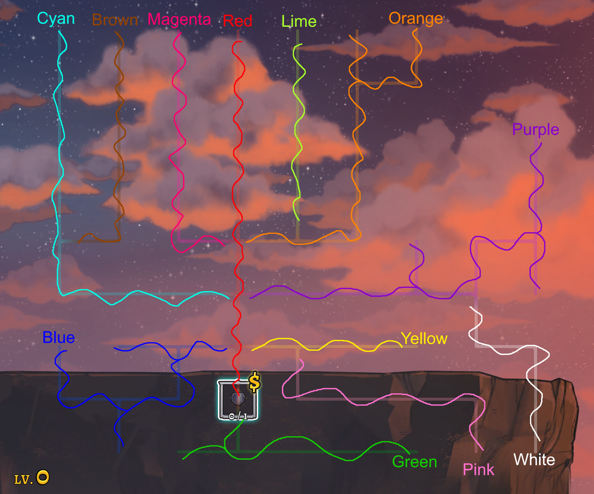

# Rogue Legacy 2 Archipelago Randomizer
This is a mod for Rogue Legacy 2 which integrates the game with the [Archipelago project](https://archipelago.gg)

## Gameplay and Randomization Features / Changes

The run is completed as normal by defeating Cain. All biome bosses must be defeated to unlock the golden doors as normal. All collectables in the run are randomized:

- All manor upgrades (class unlocks, stat increases, etc.), heirlooms, blueprints, runes, and teleporter unlocks are shuffled into randomized locations
- Locations where items can be found:
  - Fairy chests
  - Normal and Silver chests (items drop with the same probability as blueprints would in normal gameplay)
  - Boss and mini-boss kills
  - Journals and memories (configurable)
  - Manor upgrades
  - Pizza girl purchases
  - Heirloom statues (and Johann's conversation in Pishon Dry Lake after defeating Irad)

### Manor Upgrade Location Names

The manor upgrade tree doesn't have intuitive in-game names for its individual slots, so the location associated with each one is named after a given colored path it sits on and its position along that path, for example, `Cyan Path Upgrade 4` or `Red Path Upgrade 7`. The mod draws these colored paths directly onto the manor screen in-game so a location name can be traced to the slot it refers to.

If you have trouble distinguishing the path colors, the chart below labels each one with its name in text.

<details>
<summary>Expand to see the labeled manor path chart</summary>



</details>

## Configurable options (i.e. The player YAML)

There are several things that can be customized for each run using the Archipelago YAML file

<details>
<summary>Expand to see the YAML configuration options</summary>

---

### Deathlink (`death_link`)

**Values:** enabled / disabled

Kills your character when another player with deathlink enabled dies. Triggers deaths for other players with deathlink enabled when you die.

---

### Normal/Silver Chest Checks per Biome (`blueprint_checks_per_biome`)

**Range:** 0–16 | **Default:** 11 *(11 checks × 6 biomes = 66 checks, approximately matching the 65 total blueprints in the base game)*

Normal and silver chests have a random chance to roll into an AP item (by default the same probability as the base game: 15% for a normal chest, 99% for a silver chest - see `bronze_chest_ap_chance` and `silver_chest_ap_chance` below). This setting controls how many AP checks you can get from opening chests in each biome. Once all checks have been completed in a biome, all chests will only give gold, like the base game.

---

### Fairy Chest Checks per Biome (`rune_checks_per_biome`)

**Range:** 0–16 | **Default:** 4 *(4 checks × 6 biomes = 24 checks, matching the 24 total runes in the base game)*

When a fairy chest is opened, an AP item will be given every time until the pool is exhausted (see `fairy_chest_ap_chance` below to make this a percentage chance instead). Then chests will just drop red aether as normal.

---

### Chest AP Chances (`bronze_chest_ap_chance`, `silver_chest_ap_chance`, `fairy_chest_ap_chance`)

| Setting | Range | Default |
|---|---|---|
| `bronze_chest_ap_chance` | 1–100 | 15 |
| `silver_chest_ap_chance` | 1–100 | 99 |
| `fairy_chest_ap_chance` | 1–100 | 100 |

The percent chance that opening a chest of the given type triggers an AP location check rather than dropping normal loot. The defaults for bronze and silver chests match the base game's blueprint drop rates, and fairy chests always give a check by default.

Each chest type can be tuned independently. Raising a value means fewer chests need to be opened to clear a biome's pool; lowering it means more. Once a biome's pool of checks is exhausted (see the two settings above), chests fall back to normal loot: gold for bronze/silver, red aether for fairy chests, regardless of these settings.

---

### Manor Upgrade Bundle Size (`manor_upgrade_bundle_size`)

**Range:** 1–35 | **Default:** 5

Many manor upgrades have multiple levels available. In the randomizer, granting only one level at a time would make progression feel too slow for most players. So instead, these multi-level upgrades are granted in bundles; checking one AP location can grant a bundle which gives *n* levels to a manor upgrade (e.g. +5 dexterity instead of +1).

This setting controls how big each bundle is, and therefore how many AP items are created for manor upgrades. For example, if an upgrade has 20 total levels, a bundle size of 5 results in 4 AP items; a bundle size of 10 results in only 2. The total levels for a slot are based on the max level excluding NG+ soul shop purchases. Generally, increasing this number makes the run easier and decreasing it makes it harder.

If the max level for a particular skill is not divisible by the bundle size, the last bundle will be capped to the max level and grant fewer levels than the others.

---


### Journal/Memory Checks (`journal_checks`)

**Values:** `disabled` / `individual` / `grouped` | **Default:** `grouped`

Controls how AP checks are awarded from reading journals and memories.

- **disabled** - no AP checks for journals or memories
- **individual** - one check per unique journal or memory read
- **grouped** - one check after reading all journals in a biome, and one after reading all memories in a biome

There are 41 total memories and journals, and 8 groups (some biomes have no memories and therefore no group check).

---

### Trap Count (`trap_count`)

**Range:** 0–25 | **Default:** 3

Traps are a feature in Archipelago where checking a location may give the player a negative reward. In Rogue Legacy 2, traps activate a random biome environmental burden for the remainder of the current heir's life. This effect will occur in all valid rooms, not just the intended biome.

There are 5 available traps:
- Cannonball Rain *(Burden of Mundi's Flagship)*
- Dragon Lancers *(Burden of Irad's Torment)*
- Automaton Swarm *(Burden of Pishon's Uprising)*
- Giant Snowflakes *(Burden of Kerguelen's Frost)*
- Void Waves *(Burden of the High Scholar's Metamorphosis)*

Traps are distributed as evenly as possible across the five types. Set to 0 to disable traps entirely.

---

### Trap Appearance (`trap_appearance`)

**Values:** `hidden` / `visible` | **Default:** `hidden`

Controls whether traps can be identified before you pay for them. Anywhere the game shows what an unclaimed location holds (the manor upgrade tree, the teleporter NPC, heirloom pedestals), a trap would otherwise announce itself and be trivially avoidable.

- **hidden** - traps are disguised as a real item taken from elsewhere in the multiworld, and are only revealed once purchased
- **visible** - traps show their true name and icon before purchase

---

### Manor Upgrade Costs (`manor_cost_base`, `manor_cost_min_subtractive_factor`, `manor_cost_max_additive_factor`)

| Setting | Range | Default |
|---|---|---|
| `manor_cost_base` | 1–9999 | 100 |
| `manor_cost_min_subtractive_factor` | 0–100 | 20 |
| `manor_cost_max_additive_factor` | 0–500 | 50 |

The typical manor upgrade costs don't scale well in an Archipelago run, so a custom pricing formula is used. It incorporates a "depth" value which is determined by how many prior manor purchases were required to unlock a given slot. The first available slot is depth 1; slots unlocked after the first purchase are depth 2; and so on, up to a maximum of depth 11.

The formula is:

```
cost = base × depth × random_factor
```

`random_factor` is a random decimal chosen uniformly between `(1 - subtractive_factor/100)` and `(1 + additive_factor/100)`. With the defaults, this means each upgrade costs `base × depth`, then randomly adjusted to be up to 20% cheaper or 50% more expensive.

---

### Progression Gating

> **Warning:** Tightening these options can cause generation errors if the resulting logical requirements become too difficult to satisfy.

#### Manor Depths Per Boss Gate (`manor_depths_per_boss`)

**Range:** 0–11 | **Default:** 3

Each manor upgrade has a "depth" value reflecting how many upgrades are required to be purchased before this upgrade becomes available. This setting controls how many depth tiers are added into the "in-logic" pool per boss killed. The first *x* tiers are always in logic; each subsequent boss opens the next *x* tiers.

With the default of 3: depths 1–3 are available from the start, depths 4–6 require 1 boss cleared, depths 7–9 require 2, and so on. Set to 0 to disable this gating entirely.

---

#### Chest Pre-Boss Percent (`chest_pre_boss_percent`)

**Range:** 50–100 | **Default:** 75

The percentage of each biome's blueprint chest and fairy chest locations considered in logic *before* the biome's boss is killed. The remaining checks only become in-logic after the boss is defeated.

This reduces the chance of a situation where every chest in a biome must be cleared just to obtain the items needed to beat its boss.

---

#### Stat Upgrades Per Boss (`stat_upgrades_per_boss`)

**Range:** 0–10 | **Default:** 5

The number of received stat upgrade items required such that the next boss is considered "in-logic", scaling additively per boss. With the default of 5: Estuary Lamech requires 5 upgrades, Byarrrith and Halpharr require 10, Estuary Naamah requires 15, Estuary Enoch requires 20, Estuary Irad requires 25, and Estuary Tubal requires 30. The Gonghead and Murmur minibosses share Naamah's threshold; the Pishon Dry Lake minibosses share Irad's.

Set to 0 to disable stat-upgrade gating for bosses.

---

#### Stat Upgrades Per Biome Tier (`stat_upgrades_per_biome_tier`)

**Range:** 0–10 | **Default:** 5

The base number of received stat upgrade items logically required before each later biome's chest and journal/memory locations are considered in logic. The requirement scales per biome starting at biome 3: Kerguelen Plateau requires *x*, Stygian Study requires *2x*, Sun Tower requires *3x*, and Pishon Dry Lake requires *4x*. Citadel Agartha and Axis Mundi are never gated by this setting.

Set to 0 to disable stat-upgrade gating for biomes.

---

#### Early NPC Unlocks (`early_npc_unlocks`)

**Values:** true / false | **Default:** true

When enabled, soft logic rules push the three NPC unlock items (Living Safe, Blacksmith, Enchantress) toward earlier locations in the run, reducing the chance they are gated deep into a long seed.

---

### Randomize Starting Class (`randomize_starting_class`)

**Values:** enabled / disabled | **Default:** enabled

When enabled, the default unlocked class is randomized instead of always being a knight. The chosen class is pre-unlocked at run start and removed from the item pool. If the starting class is not Knight, the Knight class becomes a randomizable item in the multiworld and must be found before Knight heirs can appear.

---

### Reveal Manor Upgrades (`reveal_manor_upgrades`)

**Values:** true / false | **Default:** false

When enabled, every manor upgrade node is shown from the start instead of only the ones adjacent to a purchase. This makes it easier to see the whole tree and plan a route through it.

Purchase rules are unchanged: a node still cannot be bought until the node before it has been purchased. Revealed-but-locked nodes show a padlock.

</details>


## Installation

Rogue Legacy 2 must already be installed. All files needed can be downloaded from the [GitHub releases page](https://github.com/zaphim12/RL2Archipelago/releases). Look at the most recent release and scroll down to Assets.

> **Note:** Mac and Linux compatibility has not been tested, but should likely work fine.

### Installing the Mod

1. Download and install [BepInEx](https://docs.bepinex.dev/articles/user_guide/installation/index.html). BepInEx is the mod injector that allows the mod to modify gameplay without altering game files.
   - Any latest stable release will work. The BepInEx installation page links to their GitHub releases. Scroll to Assets and download the version for your OS.
   - Extract the BepInEx files into the game's root directory. On Windows this is typically: `C:\Program Files (x86)\Steam\steamapps\common\Rogue Legacy 2\`
   - Run the game once so BepInEx can generate its required files.

2. Download and extract the RL2Archipelago mod files into BepInEx's plugins folder.
   - If you are only playing (not generating the Archipelago world), you only need `RL2Archipelago.zip`.
   - If the `plugins` folder doesn't exist within the BepInEx directory, create it.
   - Your final path after extracting should be (on Windows): `C:\Program Files (x86)\Steam\steamapps\common\Rogue Legacy 2\BepInEx\plugins\RL2Archipelago`

### Generating the Archipelago

1. Make sure the person generating the Archipelago has a player YAML and the `.apworld` file.
   - There are two easy ways to get a player YAML:
     - Download `RL2_template.yaml` from the GitHub releases page, then edit it to customize your run. You can rename it to anything you like.
     - Use the Archipelago launcher: first install the APWorld via "Install APWorld", then use the "Options Creator" to generate a player YAML.
   - Whoever generates the Archipelago will need to add the `.apworld` to their Archipelago launcher installation.

## Disclaimers

- This mod requires a legitimate copy of Rogue Legacy 2.
- This is an unofficial mod and is not affiliated with Cellar Door Games.

## Contact Info

Feel free to open an issue here on GitHub for any questions or bugs. You can also reach me on Discord at @zaphim12. I'm in the [Archipelago Discord server](https://discord.gg/8Z65BR2) and can be messaged directly or via the `#rogue-legacy-2` channel.
